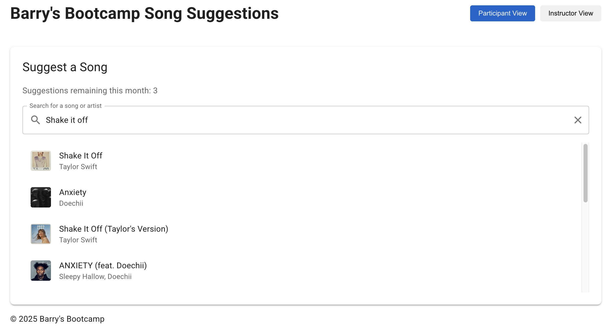
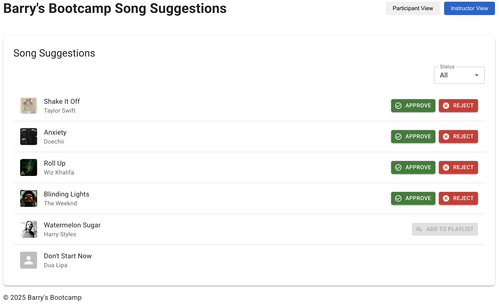

I'll help you display the MP4 demo file in your README. In GitHub Markdown, you can reference video files in a few different ways. Here's the updated README with the video demo section properly configured:

```markdown
# Barry's Bootcamp Song Suggestion System

A proof-of-concept application that enables Barry's Bootcamp participants to suggest songs for their classes and instructors to manage these suggestions efficiently.

## Overview

This application bridges the gap between participants and instructors at Barry's Bootcamp, creating a more engaging and personalized class experience. Participants can search for and suggest songs via Spotify integration, while instructors can review, approve, or reject these suggestions before adding them to their playlists.

## Features

- **Participant Song Suggestions**: Search Spotify and suggest songs for specific classes
- **Suggestion Quota System**: Each participant has a limited number of suggestions per month
- **Instructor Review Interface**: View, filter, approve, or reject song suggestions
- **Spotify Integration**: Search for songs and preview them before suggesting
- **Responsive Design**: Works on both desktop and mobile devices

## User Experience

### Participant View

Participants can:
1. **View their quota**: See how many song suggestions remain for the current month
2. **Search for songs**: Type a song title or artist to search Spotify's library
3. **Preview results**: View song details including title, artist, and album artwork
4. **Submit suggestions**: Suggest songs for their upcoming classes
5. **Receive feedback**: Get instant confirmation when suggestions are submitted

### Instructor View

Instructors can:
1. **View all suggestions**: Browse through songs suggested by participants
2. **Filter suggestions**: Filter by status (pending, approved, rejected)
3. **Manage suggestions**: Approve or reject song suggestions
4. **Preview future integration**: See placeholder for adding songs directly to Spotify playlists

## Demo

### Video Demo

https://github.com/mruckman1/barrys-song-suggestion/blob/main/assets/SongSuggestionDemo.mp4

### Screenshots

#### Participant View


#### Instructor View


## Technical Details

### Architecture

The application follows a modern client-server architecture:

```
┌─────────────┐       ┌─────────────┐       ┌─────────────┐
│   Frontend  │ ───▶  │   Backend   │ ───▶  │   Spotify   │
│   (React)   │ ◀───  │  (FastAPI)  │ ◀───  │     API     │
└─────────────┘       └─────────────┘       └─────────────┘
                            │
                            ▼
                      ┌─────────────┐
                      │  Database   │
                      │  (MongoDB)  │
                      └─────────────┘
```

### Technologies Used

#### Frontend
- **React**: User interface library
- **TypeScript**: Type-safe JavaScript
- **Material UI**: Component library for consistent design
- **Vite**: Fast build tooling

#### Backend
- **FastAPI**: Modern Python web framework
- **Motor**: Asynchronous MongoDB driver for Python
- **Spotify Web API**: For song search and metadata

#### Infrastructure
- **Docker**: Containerization for easy deployment
- **MongoDB**: NoSQL database for flexible data storage

### Setup and Installation

1. **Clone the repository**
   ```bash
   git clone https://github.com/yourusername/barrys-song-suggestion.git
   cd barrys-song-suggestion
   ```

2. **Set up environment variables**
   ```bash
   # Create .env file at the root
   cp .env.example .env
   
   # Add your Spotify API credentials
   SPOTIFY_CLIENT_ID=your_client_id_here
   SPOTIFY_CLIENT_SECRET=your_client_secret_here
   ```

3. **Start the application with Docker**
   ```bash
   docker-compose up
   ```

4. **Access the application**
   - Frontend: http://localhost:3000
   - Backend API: http://localhost:8000

### API Documentation

The backend exposes the following endpoints:

- `GET /spotify/search`: Search songs on Spotify
- `GET /suggestions/`: Get song suggestions with optional filters
- `POST /suggestions/`: Submit a new song suggestion
- `PATCH /suggestions/{id}`: Update suggestion status
- `GET /quota/{user_id}`: Check participant's remaining suggestion quota

## Acknowledgments

- Built with Spotify Web API
- Inspired by Barry's Bootcamp's music-driven workouts

---

*This project is a Proof of Concept and not affiliated with the official Barry's Bootcamp.*